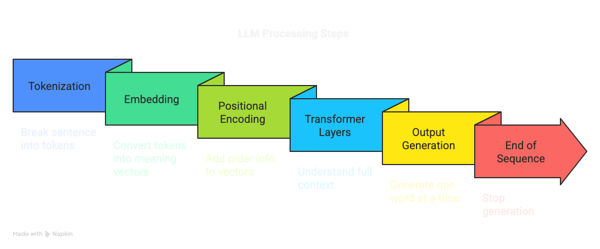
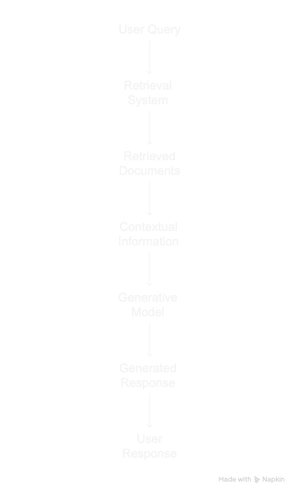

# llm-primer
An introduction to LLM's, RAG's and Agents

<details>
<Summary>What are LLM's? </summary>
A large language model (LLM) is a machine learning model designed for natural language processing tasks, especially language generation. LLMs are language models with many parameters, and are trained with self-supervised learning on a vast amount of text. 
</details>

<details>
<Summary>How do LLM's work?</summary>
At its core, an LLM takes text as input and tries to predict the next word in that sequence. This process is repeated until the model generates an End of Sequence(EOS) token.

Example:

### 🧠 How an LLM Answers: “What is the capital of India?”

---

#### 📌 Overview  
Large Language Models like ChatGPT process input in a series of steps to generate a meaningful response — one word at a time.

---

#### 🔍 **Step-by-Step Breakdown**

##### 1. **Tokenization**
> ✂️ The input is split into smaller pieces called *tokens*.

```
Input: "What is the capital of India?"
Tokens: ["What", "is", "the", "capital", "of", "India", "?"]
```

---

##### 2. **Embedding**
> 🔢 Each token is converted into a high-dimensional vector that captures its meaning.

```
Example:
"India" → [0.21, -1.44, 0.33, ...]
```

---

##### 3. **Positional Encoding**
> 📏 The model adds position information to each token’s vector to understand order.

| Token   | Position | Combined Vector |
|---------|----------|-----------------|
| "What"  | 0        | Meaning + Pos 0 |
| "India" | 5        | Meaning + Pos 5 |

---

##### 4. **Transformer Layers**
> 🏗️ This is where the real “thinking” happens — multiple layers analyze the entire sentence.

Each layer includes:
- **Self-Attention:** Tokens look at each other to understand context.
- **Feedforward Network:** Extra computation to refine understanding.

🔄 Repeated across many layers.

---

##### 5. **Autoregressive Generation**
> ✍️ The model generates one word at a time by predicting the most likely next token.

| Step | Model Sees | Model Predicts |
|------|------------|----------------|
| 1    | Question   | `"The"`        |
| 2    | + "The"    | `"capital"`    |
| 3    | + "capital"| `"of"`         |
| 4    | + "of"     | `"India"`      |
| 5    | + "India"  | `"is"`         |
| 6    | + "is"     | `"New"`        |
| 7    | + "New"    | `"Delhi"`      |
| 8    | + "Delhi"  | `"."`          |
| 9    | + "."      | `[EOS]` ← *(End of Sequence)*

---

##### ✅ **Final Output:**
```
"The capital of India is New Delhi."
```

---

### 🧠 Recap


---

### 📚 Resources

- 🔗 [Transformer Visualizer](https://poloclub.github.io/transformer-explainer/)

---
</details>


<details>
<Summary>How to run LLM's Locally?</summary>

### 📥 Step 1: Install Ollama

Ollama is a tool that lets you run large language models locally on your machine.

#### 🖥️ For macOS

```bash
curl -fsSL https://ollama.com/install.sh | sh
```

#### 🐧 For Linux

```bash
curl -fsSL https://ollama.com/install.sh | sh
```

> ✅ This installs the `ollama` command-line tool and sets it up.

#### 🪟 For Windows

1. Download the installer from: [https://ollama.com/download](https://ollama.com/download)
2. Run the installer and follow the instructions.

---

### 🧠 Step 2: Download a Model

You can pull a model using the `ollama pull` command.

#### Example: Pull the LLaMA 3 model

```bash
ollama pull qwen3:0.6b
```

Other popular models:
- `mistral`
- `gemma`
- `llama2`
- `codellama`

---

### 🚀 Step 3: Run the Model

Once the model is downloaded, you can start a chat session:

```bash
ollama run qwen3:0.6b
```

Then just type your questions or prompts!

---

### ⚙️ Tips

- Use `ollama list` to see all downloaded models.
- Use `ollama run <model-name>` to chat with any installed model.
- Check system requirements: Ollama works best with enough RAM and a modern CPU or GPU.

---

### 📚 Resources

- 🔗 [Ollama Website](https://ollama.com/)
- 📖 [Ollama Documentation](https://ollama.com/library)

---
</details>

<details>
<Summary>What is RAG? </summary>
Retrieval-augmented generation is a technique that enables large language models to retrieve and incorporate new information. With RAG, LLMs do not respond to user queries until they refer to a specified set of documents. These documents supplement information from the LLM's pre-existing training data.

  
  
A code example of a simple RAG application is provided [here](rag)
</details>

<details>
<Summary>What are Agents? </summary>

An artificial intelligence (AI) agent refers to a system or program that is capable of autonomously performing tasks on behalf of a user or another system by designing its workflow and utilizing available tools.

AI agents can encompass a wide range of functionalities beyond natural language processing including decision-making, problem-solving, interacting with external environments and executing actions.

These agents can be deployed in various applications to solve complex tasks in various enterprise contexts from software design and IT automation to code-generation tools and conversational assistants. They use the advanced natural language processing techniques of large language models (LLMs) to comprehend and respond to user inputs step-by-step and determine when to call on external tools.

A code example of a simple agentic application is provided [here](agent)
</details>

<details>
<Summary>What is MCP? </summary>

Today, we're open-sourcing the Model Context Protocol (MCP), a new standard for connecting AI assistants to the systems where data lives, including content repositories, business tools, and development environments. Its aim is to help frontier models produce better, more relevant responses.

A code example a MCP server and a langchain agent using the MCP can be found here [here](mcp)
</details>
